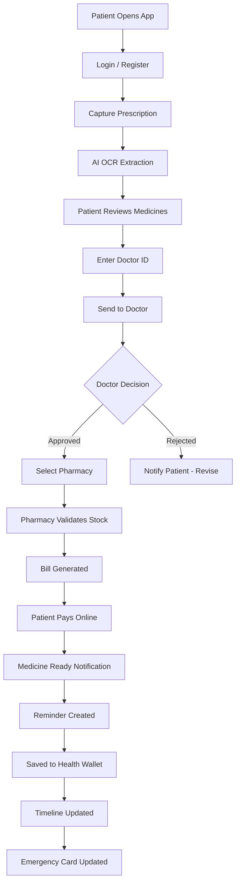
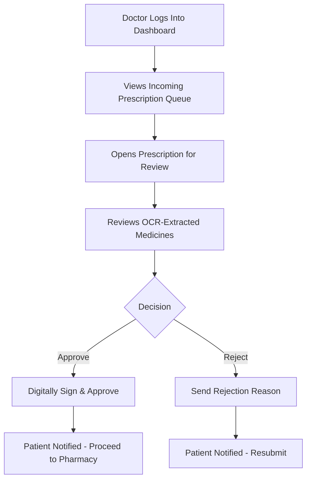
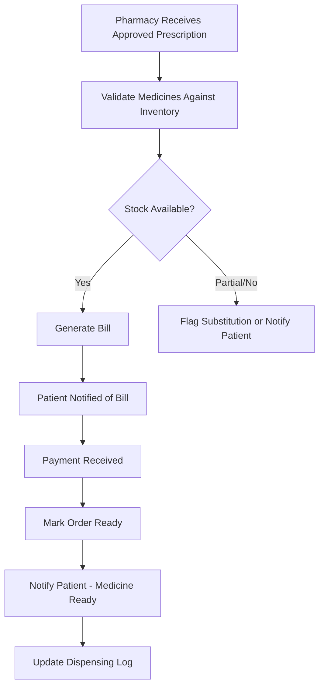
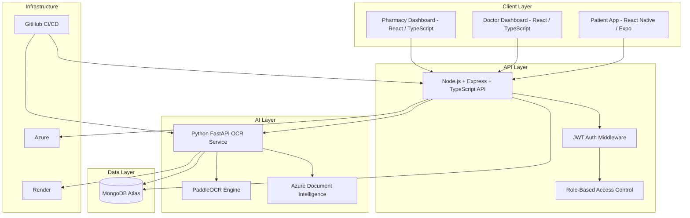
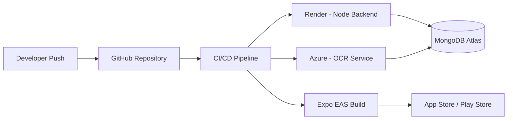
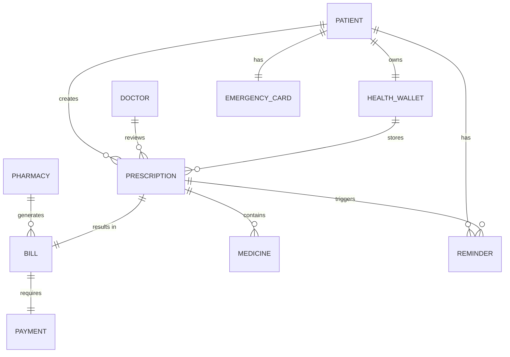
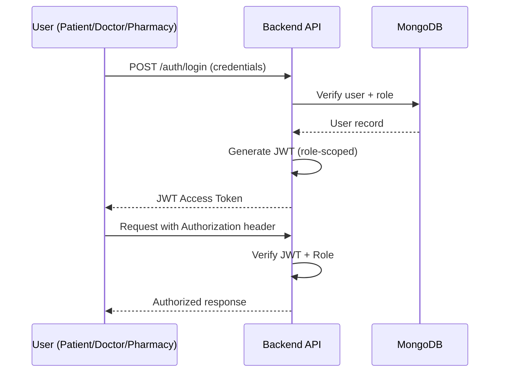
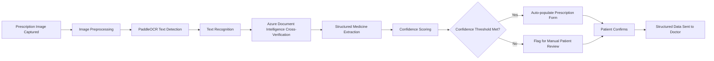

<div align="center">

# 🩺 RxDigit

### AI-Powered Digital Prescription & Healthcare Ecosystem

*Turning handwritten prescriptions into a connected, secure, digital healthcare workflow — for Patients, Doctors, and Pharmacies.*

[](#)
[](#license)
[](#technology-stack)
[](#technology-stack)
[](#technology-stack)
[](#technology-stack)
[](#ocr-pipeline)
[](#product-overview)
[](#product-roadmap)

<br/>

**[Overview](#product-overview) · [Features](#key-features) · [Architecture](#complete-system-architecture) · [Installation](#installation-guide) · [API](#api-overview) · [Roadmap](#product-roadmap) · [Business Model](#business-model)**

</div>

---

## Product Overview

Prescriptions are the single most important document in a patient's healthcare journey — and also one of the most fragile. A handwritten slip of paper carries dosage, frequency, and clinical intent, yet it is routinely lost, misread, illegible, or disconnected from any digital record the moment it leaves the doctor's hand.

**RxDigit** replaces that fragile paper trail with a secure, structured, and connected digital workflow. Using AI-powered Optical Character Recognition (OCR), RxDigit converts handwritten or printed prescriptions into structured digital data, then routes that data through a verified clinical and pharmacy workflow — from doctor approval, to pharmacy billing, to medicine reminders, to a lifelong personal Health Wallet.

RxDigit is not an OCR utility. It is a multi-sided healthcare platform connecting three stakeholders — **Patients, Doctors, and Pharmacies** — inside a single, auditable, digital record of care.

> [!NOTE]
> This repository contains the core platform: the Patient mobile application, Doctor web dashboard, Pharmacy web dashboard, the OCR microservice, and the backend API that connects them.

---

## Problem Statement

| Problem | Impact |
|---|---|
| Handwritten prescriptions are frequently illegible | Medication errors, incorrect dispensing, patient safety risk |
| No digital record of past prescriptions | Doctors re-diagnose without full history; patients lose paper slips |
| Manual pharmacy billing and stock validation | Delays, human error, no real-time inventory checks against a prescription |
| No adherence tracking after the prescription is filled | Missed doses, poor treatment outcomes |
| Fragmented systems between clinics, pharmacies, and patients | No single source of truth for a patient's medical history |
| No emergency access to medical information | Critical delays in emergency care situations |

Healthcare in most emerging markets still runs on paper at the last mile — the point where a doctor's decision becomes a patient's treatment. RxDigit is built to digitize precisely that last mile.

---

## Why RxDigit

**The Problem:** Paper prescriptions break down at every handoff — doctor to patient, patient to pharmacy, pharmacy to record-keeping.

**The Solution:** RxDigit digitizes the prescription at the point of creation using AI OCR, then keeps it structured, verified, and connected through every downstream step — approval, billing, payment, and reminders — inside one ecosystem.

**The Impact:**

- Reduced medication and dispensing errors through structured, doctor-verified digital prescriptions
- A permanent, searchable digital health record for every patient
- Faster pharmacy turnaround through automated inventory validation and billing
- Higher medication adherence through automated reminders
- Emergency-ready health information available instantly, for every patient

---

## Key Features

<table>
<tr>
<td valign="top" width="33%">

### 🧑‍🦱 Patient Features
- AI prescription capture & OCR
- Doctor-linked prescription submission
- Real-time approval status
- Pharmacy selection & billing
- In-app payments
- Medicine reminders
- Digital Health Wallet
- Prescription Timeline
- Emergency Health Card

</td>
<td valign="top" width="33%">

### 🩺 Doctor Features
- Prescription review queue
- Approve / Reject workflow
- Patient prescription history
- Digital signature on approval
- Structured medicine data review
- Notification on new submissions

</td>
<td valign="top" width="33%">

### 💊 Pharmacy Features
- Incoming prescription queue
- Inventory validation against prescription
- Automated bill generation
- Payment status tracking
- Order-ready notifications
- Dispensing history log

</td>
</tr>
<tr>
<td valign="top" width="33%">

### 🤖 AI Features
- Handwriting OCR (PaddleOCR-based)
- Structured medicine extraction
- Confidence-scored predictions
- Human-in-the-loop correction
- (Roadmap) Drug interaction detection
- (Roadmap) AI health assistant

</td>
<td valign="top" width="33%">

### 🔐 Security Features
- JWT-based authentication
- Role-based access control
- Encrypted prescription data
- Audit trail on approvals
- Secure payment handling

</td>
<td valign="top" width="33%">

### 📊 Platform Features
- Multi-sided role architecture
- Real-time notification system
- Unified prescription history
- Cross-role status sync
- Scalable microservice OCR layer

</td>
</tr>
</table>

---

## Product Screenshots

> [!NOTE]
> Screenshots will be added as the product UI is finalized for each release. Placeholders below map to the corresponding screen in the Patient, Doctor, and Pharmacy applications.

<details>
<summary><strong>📱 View Screenshot Placeholders</strong></summary>

| Screen | Preview |
|---|---|
| Login | `[ screenshot: login.png ]` |
| Register | `[ screenshot: register.png ]` |
| Upload Prescription | `[ screenshot: upload-prescription.png ]` |
| OCR Result | `[ screenshot: ocr-result.png ]` |
| Doctor Review | `[ screenshot: doctor-review.png ]` |
| Pharmacy Dashboard | `[ screenshot: pharmacy-dashboard.png ]` |
| Billing | `[ screenshot: billing.png ]` |
| Payment | `[ screenshot: payment.png ]` |
| Reminder | `[ screenshot: reminder.png ]` |
| Health Wallet | `[ screenshot: health-wallet.png ]` |
| Timeline | `[ screenshot: timeline.png ]` |
| Emergency Card | `[ screenshot: emergency-card.png ]` |
| Profile | `[ screenshot: profile.png ]` |

</details>

---

## Product Demo

> [!NOTE]
> Demo videos will be linked here as they are recorded for pilot and investor walkthroughs.

<details>
<summary><strong>🎥 View Demo Placeholders</strong></summary>

| Demo | Link |
|---|---|
| Patient Journey | `[ video: patient-journey.mp4 ]` |
| Doctor Workflow | `[ video: doctor-workflow.mp4 ]` |
| Pharmacy Workflow | `[ video: pharmacy-workflow.mp4 ]` |
| Complete Product Demo | `[ video: full-product-demo.mp4 ]` |
| Architecture Walkthrough | `[ video: architecture-walkthrough.mp4 ]` |

</details>

---

## Complete Healthcare Workflow

1. Patient opens the mobile app
2. Login / Register
3. Capture prescription (camera or gallery upload)
4. AI OCR engine extracts medicine data
5. Patient reviews and confirms extracted medicines
6. Patient enters the treating Doctor's ID
7. Prescription is sent to the Doctor for review
8. Doctor approves or rejects the prescription
9. Patient receives a real-time notification of the decision
10. Patient selects a Pharmacy
11. Prescription is routed to the selected Pharmacy
12. Pharmacy validates medicine availability against inventory
13. Pharmacy generates the bill
14. Patient receives the bill in-app
15. Patient completes payment online
16. Patient receives a "Medicine Ready" notification
17. A Medicine Reminder schedule is created automatically
18. The prescription is saved to the Digital Health Wallet
19. The event appears in the patient's Prescription Timeline
20. The patient's Emergency Card is updated with the latest record

### Patient Workflow



### Doctor Workflow



### Pharmacy Workflow



---

## Complete System Architecture



### Deployment Architecture



### Database Relationship



### Authentication Flow



### OCR Pipeline



---

## Folder Structure

```
rxdigit/
├── apps/
│   ├── patient-app/                 # React Native (Expo) — Patient mobile application
│   │   ├── app/                     # Expo Router screens
│   │   ├── components/
│   │   ├── hooks/
│   │   ├── services/                # API clients
│   │   └── assets/
│   │
│   ├── doctor-dashboard/            # React + TypeScript + Tailwind
│   │   ├── src/
│   │   │   ├── pages/
│   │   │   ├── components/
│   │   │   ├── features/review-workspace/
│   │   │   └── services/
│   │   └── public/
│   │
│   └── pharmacy-dashboard/          # React + Tailwind
│       ├── src/
│       │   ├── pages/
│       │   ├── components/
│       │   └── services/
│       └── public/
│
├── services/
│   ├── backend-api/                 # Node.js + Express + TypeScript
│   │   ├── src/
│   │   │   ├── routes/
│   │   │   ├── controllers/
│   │   │   ├── models/              # Mongoose schemas
│   │   │   ├── middleware/          # Auth, RBAC, validation
│   │   │   └── config/
│   │   └── tests/
│   │
│   └── ocr-service/                 # Python + FastAPI
│       ├── app/
│       │   ├── routers/
│       │   ├── ocr_engine/          # PaddleOCR pipeline
│       │   ├── models/
│       │   └── utils/
│       └── tests/
│
├── docs/
│   ├── architecture/
│   ├── api/
│   └── design-system/
│
├── .github/
│   └── workflows/                   # CI/CD pipelines
│
├── docker-compose.yml
├── .env.example
└── README.md
```

---

## Technology Stack

<table>
<tr><th>Layer</th><th>Technology</th></tr>
<tr>
<td>Patient Mobile App</td>
<td>React Native · Expo · TypeScript · Expo Router</td>
</tr>
<tr>
<td>Doctor Dashboard</td>
<td>React · TypeScript · Tailwind CSS</td>
</tr>
<tr>
<td>Pharmacy Dashboard</td>
<td>React · Tailwind CSS</td>
</tr>
<tr>
<td>Backend API</td>
<td>Node.js · Express.js · TypeScript</td>
</tr>
<tr>
<td>OCR Service</td>
<td>Python · FastAPI · PaddleOCR · Azure Document Intelligence</td>
</tr>
<tr>
<td>Database</td>
<td>MongoDB Atlas · Mongoose</td>
</tr>
<tr>
<td>Authentication</td>
<td>JWT (JSON Web Tokens)</td>
</tr>
<tr>
<td>Hosting / Infra</td>
<td>Azure · Render · GitHub Actions</td>
</tr>
</table>

---

## Design System

RxDigit follows a dedicated Healthcare Design Language, tuned for clarity, trust, and clinical legibility.

| Token | Value | Usage |
|---|---|---|
| Primary | `#2563EB` Royal Blue | Primary actions, links, active states |
| Success | `#10B981` Emerald | Approvals, successful payments, confirmations |
| Hero Background | `#0B132B` Deep Navy | Hero sections, high-contrast headers |
| Background | `#F8FAFC` | App and dashboard background |
| Surface | White | Cards, panels, modals |
| Radius | Rounded (soft) | All cards and interactive elements |
| Elevation | Soft shadow | Card depth, layered UI |

The result is a premium, clinical-grade interface consistent across the Patient app, Doctor dashboard, and Pharmacy dashboard.

---

## Installation Guide

### Prerequisites

| Requirement | Version |
|---|---|
| Node.js | ≥ 18.x |
| npm / yarn | latest |
| Python | ≥ 3.10 |
| MongoDB Atlas | account + connection string |
| Expo CLI | latest |
| Azure Document Intelligence | API key |

### Clone the Repository

```bash
git clone https://github.com/rxdigit/rxdigit.git
cd rxdigit
```

### Install Dependencies

```bash
# Backend API
cd services/backend-api
npm install

# OCR Service
cd ../ocr-service
pip install -r requirements.txt

# Patient App
cd ../../apps/patient-app
npm install

# Doctor Dashboard
cd ../doctor-dashboard
npm install

# Pharmacy Dashboard
cd ../pharmacy-dashboard
npm install
```

---

## Environment Variables

Create a `.env` file in `services/backend-api/`:

```env
# Server
PORT=5000
NODE_ENV=development

# Database
MONGODB_URI=your_mongodb_atlas_connection_string

# Authentication
JWT_SECRET=your_jwt_secret
JWT_EXPIRES_IN=7d

# OCR Service
OCR_SERVICE_URL=http://localhost:8000

# Azure Document Intelligence
AZURE_DOC_INTELLIGENCE_ENDPOINT=your_azure_endpoint
AZURE_DOC_INTELLIGENCE_KEY=your_azure_key

# Payments
PAYMENT_GATEWAY_KEY=your_payment_gateway_key

# Notifications
NOTIFICATION_SERVICE_KEY=your_notification_key
```

Create a `.env` file in `services/ocr-service/`:

```env
AZURE_DOC_INTELLIGENCE_ENDPOINT=your_azure_endpoint
AZURE_DOC_INTELLIGENCE_KEY=your_azure_key
MODEL_PATH=./models/paddleocr
CONFIDENCE_THRESHOLD=0.85
```

---

## Running Backend

```bash
cd services/backend-api
npm run dev
```

Backend runs by default on `http://localhost:5000`.

## Running OCR Service

```bash
cd services/ocr-service
uvicorn app.main:app --reload --port 8000
```

OCR service runs by default on `http://localhost:8000`.

## Running Mobile App

```bash
cd apps/patient-app
npx expo start
```

Scan the QR code with Expo Go, or launch an iOS / Android simulator.

## Running Doctor / Pharmacy Dashboards

```bash
cd apps/doctor-dashboard
npm run dev

cd apps/pharmacy-dashboard
npm run dev
```

---

## API Overview

| Method | Endpoint | Description | Access |
|---|---|---|---|
| `POST` | `/api/auth/register` | Register a new user (patient, doctor, pharmacy) | Public |
| `POST` | `/api/auth/login` | Authenticate and receive JWT | Public |
| `POST` | `/api/prescriptions` | Submit a captured prescription for OCR processing | Patient |
| `GET` | `/api/prescriptions/:id` | Get prescription details | Patient / Doctor / Pharmacy |
| `PATCH` | `/api/prescriptions/:id/review` | Doctor approves or rejects a prescription | Doctor |
| `GET` | `/api/doctor/queue` | Get pending prescriptions for review | Doctor |
| `POST` | `/api/pharmacy/validate` | Validate prescription against pharmacy inventory | Pharmacy |
| `POST` | `/api/pharmacy/bill` | Generate a bill for an approved prescription | Pharmacy |
| `POST` | `/api/payments` | Process payment for a generated bill | Patient |
| `GET` | `/api/wallet/:patientId` | Retrieve patient's Health Wallet | Patient |
| `GET` | `/api/timeline/:patientId` | Retrieve patient's Prescription Timeline | Patient |
| `GET` | `/api/emergency-card/:patientId` | Retrieve patient's Emergency Card | Patient / Authorized |
| `POST` | `/api/reminders` | Create a medicine reminder | System / Patient |
| `POST` | `/api/ocr/extract` | Run OCR extraction on a prescription image | Internal (OCR service) |

> [!TIP]
> Full request/response schemas are documented in `docs/api/` and will be published as an OpenAPI 3.0 specification ahead of the developer preview.

---

## Security Features

| Feature | Description |
|---|---|
| JWT Authentication | Stateless, signed tokens scoped to user role |
| Role-Based Access Control | Distinct permission sets for Patient, Doctor, and Pharmacy roles |
| Input Validation | Schema-level validation on all API payloads |
| Encrypted Data at Rest | Sensitive prescription and payment data encrypted in MongoDB Atlas |
| Encrypted Data in Transit | HTTPS/TLS enforced across all services |
| Audit Trail | Every doctor approval/rejection is logged with timestamp and identity |
| Secure Payments | Payment data never stored directly; processed via gateway tokenization |

> [!IMPORTANT]
> RxDigit is designed with healthcare-grade data sensitivity in mind. Formal compliance certification (e.g., ABDM alignment) is part of the roadmap as the platform moves toward hospital-scale deployment.

---

## Product Modules

<details>
<summary><strong>Patient Mobile Application</strong></summary>

The primary entry point for patients — built with React Native and Expo. Handles authentication, prescription capture, OCR review, doctor submission, pharmacy selection, billing, payments, reminders, and access to the Health Wallet, Timeline, and Emergency Card.
</details>

<details>
<summary><strong>Doctor Dashboard</strong></summary>

A web-based Review Workspace where doctors view incoming prescriptions, review OCR-extracted medicine data, and approve or reject submissions. Built with React, TypeScript, and Tailwind CSS.
</details>

<details>
<summary><strong>Pharmacy Dashboard</strong></summary>

A web-based dashboard for pharmacies to receive approved prescriptions, validate stock, generate bills, and track payment and dispensing status.
</details>

<details>
<summary><strong>OCR Engine</strong></summary>

A Python/FastAPI microservice combining PaddleOCR with Azure Document Intelligence to extract structured medicine data from handwritten or printed prescription images, with confidence scoring and human-in-the-loop review for low-confidence extractions.
</details>

<details>
<summary><strong>Health Wallet</strong></summary>

A secure, persistent digital archive of every prescription, bill, and medical record associated with a patient — accessible anytime, independent of which clinic or pharmacy generated the record.
</details>

<details>
<summary><strong>Prescription Timeline</strong></summary>

A chronological view of a patient's full prescription and treatment history, giving doctors and patients a complete picture of past care.
</details>

<details>
<summary><strong>Medicine Reminder</strong></summary>

Automatically generated reminder schedules based on the dosage and frequency extracted from each approved prescription, to improve medication adherence.
</details>

<details>
<summary><strong>Emergency Card</strong></summary>

A continuously updated summary of a patient's critical health information — current medications, allergies, and recent prescriptions — accessible in emergency scenarios.
</details>

<details>
<summary><strong>Billing</strong></summary>

Pharmacy-generated, prescription-linked billing with itemized medicine costs, validated against real-time inventory.
</details>

<details>
<summary><strong>Payment</strong></summary>

In-app payment processing tied directly to a pharmacy bill, with real-time status updates back to the patient.
</details>

<details>
<summary><strong>Notification System</strong></summary>

Cross-role, real-time notifications for prescription status changes, billing, payment confirmation, and medicine readiness.
</details>

<details>
<summary><strong>Prescription History</strong></summary>

A structured, searchable record of every prescription a patient has submitted, across every doctor and pharmacy used.
</details>

<details>
<summary><strong>Future AI Assistant</strong></summary>

A planned conversational AI layer to help patients understand prescriptions, medication schedules, and flag potential drug interactions. See <a href="#future-ai-features">Future AI Features</a>.
</details>

<details>
<summary><strong>Admin Dashboard (Future)</strong></summary>

A planned internal dashboard for platform-level oversight — user management, clinic/pharmacy onboarding, and system-wide analytics.
</details>

---

## Health Wallet

The Health Wallet is RxDigit's core differentiator: a persistent, patient-owned digital record that survives across doctors, clinics, and pharmacies. Every approved prescription, generated bill, and payment record is automatically archived here — giving patients (and, with permission, their doctors) a single longitudinal view of their treatment history.

## Reminder System

Once a prescription is approved and billed, RxDigit automatically parses dosage and frequency to construct a Medicine Reminder schedule. Reminders are pushed to the patient's device and tracked for adherence, closing the loop between "prescribed" and "actually taken."

## Doctor Workflow

Doctors interact with RxDigit through a dedicated Review Workspace: a queue of incoming, OCR-processed prescriptions awaiting clinical sign-off. Doctors can review the extracted medicine list against the original captured image, then approve or reject with a digitally logged decision — ensuring every dispensed medicine has been physician-verified before it reaches a pharmacy.

## Pharmacy Workflow

Approved prescriptions flow directly into the Pharmacy Dashboard, where staff validate medicine availability against live inventory, generate an itemized bill, and track payment status through to dispensing — removing manual re-entry and reducing billing errors.

## OCR Pipeline

RxDigit's OCR pipeline combines a fine-tuned PaddleOCR (PP-OCRv3) model for handwriting recognition with Azure Document Intelligence for cross-verification, producing structured, confidence-scored medicine data. Extractions below the confidence threshold are flagged for patient review before submission to the doctor, ensuring no low-confidence data silently enters the clinical workflow.

---

## Future AI Features

| Feature | Description |
|---|---|
| AI Health Assistant | Conversational assistant for medication questions and guidance |
| Drug Interaction Detection | Flag potentially unsafe medicine combinations at prescription time |
| Medicine Recommendation | Suggest generic alternatives based on availability and cost |
| Voice Prescription | Voice-to-structured-prescription capture for doctors |
| QR Prescription | QR-code based prescription sharing and verification |
| Insurance Integration | Direct claims and coverage checks at billing |
| ABDM Integration | Alignment with India's Ayushman Bharat Digital Mission |
| Telemedicine | In-app doctor consultations tied directly to prescription issuance |
| Family Health Wallet | Shared wallet for dependents and family health management |
| Analytics Dashboard | Population-level and clinic-level health insights |
| Admin Portal | Platform-wide administration and onboarding |

---

## Business Model

RxDigit follows a multi-sided B2B2C SaaS model, monetizing across every stakeholder in the workflow:

| Segment | Model |
|---|---|
| **Clinic Subscription** | Monthly/annual SaaS fee for independent clinics and individual doctors using the Doctor Dashboard |
| **Hospital Enterprise** | Custom enterprise licensing for multi-department hospital deployments, with dedicated support and integration |
| **Pharmacy Subscription** | Monthly SaaS fee for pharmacies using the Pharmacy Dashboard, billing, and inventory validation tools |
| **Premium Patient Plan** | Optional patient subscription for extended Health Wallet storage, family accounts, and priority reminders |
| **Future B2B SaaS Model** | API-based platform licensing for insurance providers, diagnostic chains, and healthcare aggregators |

---

## Competitive Advantage

| Capability | Paper Prescription | Practo | Apollo 24|7 | Traditional Pharmacy Software | **RxDigit** |
|---|:---:|:---:|:---:|:---:|:---:|
| AI OCR digitization of handwritten prescriptions | ✗ | ✗ | ✗ | ✗ | ✅ |
| Doctor-verified digital approval workflow | ✗ | Partial | Partial | ✗ | ✅ |
| Connected patient–doctor–pharmacy loop | ✗ | ✗ | Partial | ✗ | ✅ |
| Automated inventory-linked billing | ✗ | ✗ | ✗ | Partial | ✅ |
| Unified lifelong Health Wallet | ✗ | Partial | Partial | ✗ | ✅ |
| Emergency Card | ✗ | ✗ | ✗ | ✗ | ✅ |
| Automated adherence reminders | ✗ | Partial | Partial | ✗ | ✅ |

RxDigit's differentiation is structural, not cosmetic: it is the only workflow in the table that begins at the point of illegible handwriting and ends at a verified, billed, reminder-linked, permanently archived health record — without requiring the patient, doctor, or pharmacy to leave the ecosystem.

---

## Product Roadmap

| Phase | Focus |
|---|---|
| **Phase 1 — MVP** | Core Patient, Doctor, and Pharmacy workflows; OCR pipeline; Health Wallet; billing and payments |
| **Phase 2 — Pilot Clinics** | Onboard pilot clinics and independent pharmacies; gather real-world OCR accuracy data; refine reminder adherence |
| **Phase 3 — Hospital Integration** | Multi-department hospital deployments; enterprise admin tooling; expanded analytics |
| **Phase 4 — National Scale** | ABDM integration, insurance partnerships, telemedicine, and nationwide pharmacy network coverage |

---

## Deployment

| Component | Platform |
|---|---|
| Backend API | Render |
| OCR Service | Azure |
| Patient Mobile App | Expo EAS Build → App Store / Google Play |
| Doctor / Pharmacy Dashboards | Static hosting via Render/Azure |
| Database | MongoDB Atlas (managed) |
| CI/CD | GitHub Actions |

---

## Testing Strategy

| Layer | Approach |
|---|---|
| Backend API | Unit + integration tests (Jest / Supertest) |
| OCR Service | Model accuracy benchmarking against labeled prescription datasets |
| Mobile App | Component testing + manual QA across iOS/Android |
| Dashboards | Component testing + end-to-end flow testing |
| Workflow | End-to-end testing across the full Patient → Doctor → Pharmacy loop |

---

## Contributing

RxDigit is currently developed by its core founding team. External contributions are not yet open to the public as the platform prepares for pilot deployment.

If you are a clinic, pharmacy, or healthcare organization interested in a pilot partnership, please reach out via the contact details below.

---

## License

Distributed under the MIT License. See `LICENSE` for details.

---

## Contact

For partnership inquiries, pilot programs, or investment discussions, reach out to the RxDigit founding team.

---

<div align="center">

**Made with ❤️ in India**

*RxDigit — AI-Powered Digital Prescription & Healthcare Ecosystem*

</div>
