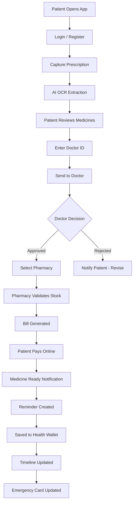
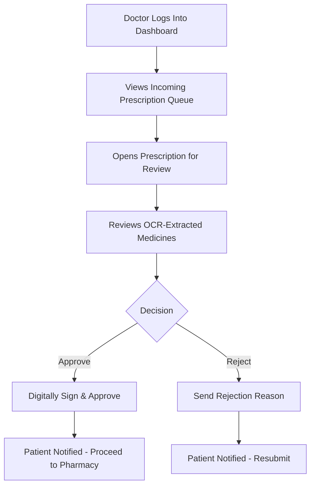
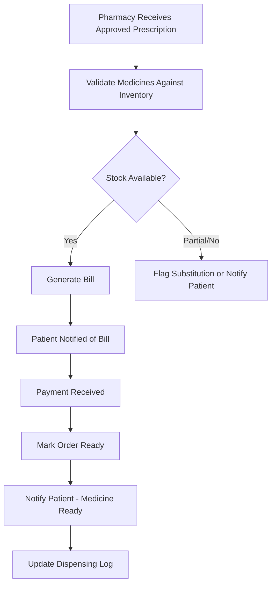
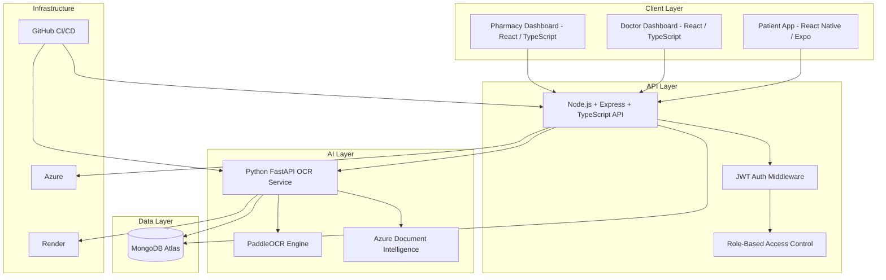
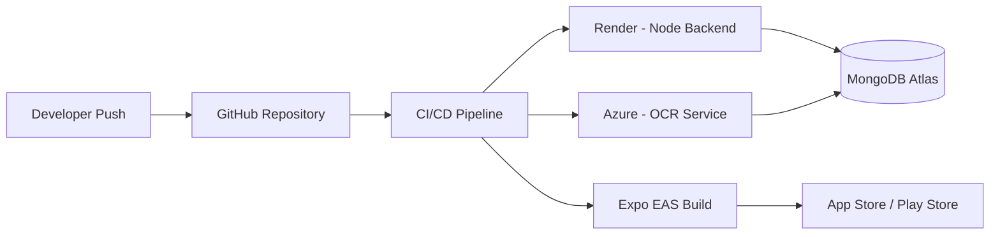
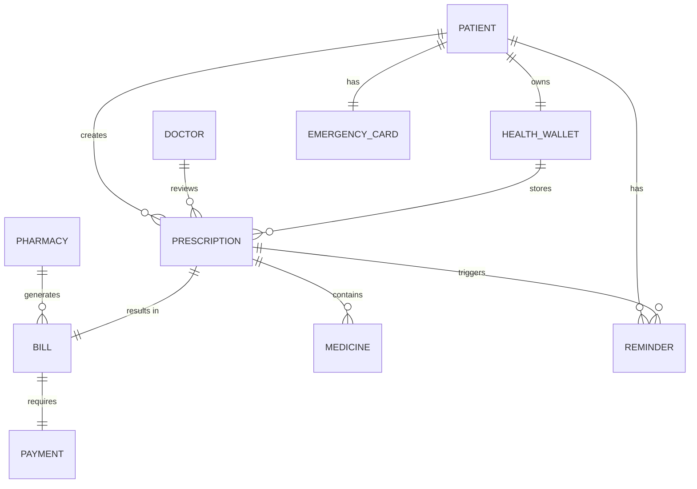
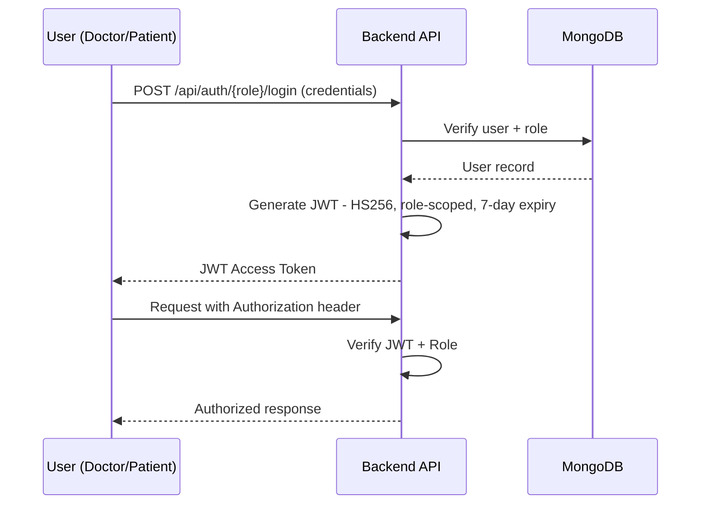
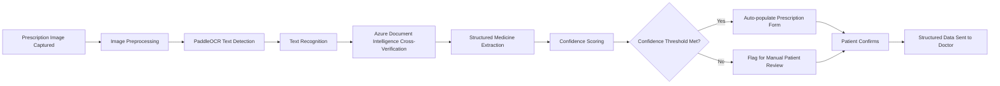

<div align="center">

# 🩺 RxDigit

### AI-Powered Digital Prescription & Healthcare Ecosystem

*Turning handwritten prescriptions into a connected, secure, digital healthcare workflow — for Patients, Doctors, and Pharmacies.*

[](#)
[](#license)
[](#technology-stack)
[](#technology-stack)
[](#technology-stack)
[](#technology-stack)
[](#ocr-pipeline)
[](#product-overview)
[](#product-roadmap)

<br/>

**[Overview](#product-overview) · [Features](#key-features) · [Architecture](#complete-system-architecture) · [Installation](#installation-guide) · [API](#api-overview) · [Roadmap](#product-roadmap) · [Business Model](#business-model)**

</div>

---

## Product Overview

Prescriptions are the single most important document in a patient's healthcare journey — and also one of the most fragile. A handwritten slip of paper carries dosage, frequency, and clinical intent, yet it is routinely lost, misread, illegible, or disconnected from any digital record the moment it leaves the doctor's hand.

**RxDigit** replaces that fragile paper trail with a secure, structured, and connected digital workflow. Using AI-powered Optical Character Recognition (OCR), RxDigit converts handwritten or printed prescriptions into structured digital data, then routes that data through a verified clinical and pharmacy workflow — from doctor approval, to pharmacy billing, to medicine reminders, to a lifelong personal Health Wallet.

RxDigit is not an OCR utility. It is a multi-sided healthcare platform connecting three stakeholders — **Patients, Doctors, and Pharmacies** — inside a single, auditable, digital record of care.

> [!NOTE]
> This repository contains the core platform: the Patient mobile application, Doctor web dashboard, Pharmacy web dashboard, the OCR microservice, and the backend API that connects them.

---

## Current Development Status

RxDigit is under active development. The table below reflects what is implemented in the codebase today versus what is on the near-term roadmap.

| Component | Status |
|---|---|
| Backend API (Node.js/Express/TypeScript) | ✅ Implemented — auth, prescriptions, doctor review, health wallet |
| JWT Authentication (doctor & patient roles) | ✅ Implemented — 7-day HS256 tokens |
| Patient App — prescription capture & structured submission | ✅ Implemented |
| Doctor Web — dashboard, review modal, approve/reject | ✅ Implemented |
| Doctor Web — notification bell with pending queue | ✅ Implemented (polling-based) |
| Doctor Web — analytics panel (charts, CSV/JSON export) | ✅ Implemented (mock data, ready for live wiring) |
| Health Wallet backend model | ✅ Implemented |
| AI OCR extraction from handwritten images | 🚧 Not yet wired into the live flow — patients currently submit structured form data directly |
| Pharmacy Dashboard | 🚧 Planned — not yet in the codebase |
| Real-time push notifications (WebSocket/Firebase) | 🚧 Planned — current updates use polling |
| Password hashing via bcrypt | 🚧 Planned — current dev build uses base64 (see [Security Features](#security-features)) |
| Billing, payments, reminders, emergency card | 🚧 Planned — described in [Product Modules](#product-modules) as target functionality |

> [!IMPORTANT]
> Sections below describing OCR, Pharmacy, Billing, Payments, and Reminders describe the product's target architecture and vision. Treat the table above as the source of truth for what is functional in the repository today.

---

## Problem Statement

| Problem | Impact |
|---|---|
| Handwritten prescriptions are frequently illegible | Medication errors, incorrect dispensing, patient safety risk |
| No digital record of past prescriptions | Doctors re-diagnose without full history; patients lose paper slips |
| Manual pharmacy billing and stock validation | Delays, human error, no real-time inventory checks against a prescription |
| No adherence tracking after the prescription is filled | Missed doses, poor treatment outcomes |
| Fragmented systems between clinics, pharmacies, and patients | No single source of truth for a patient's medical history |
| No emergency access to medical information | Critical delays in emergency care situations |

Healthcare in most emerging markets still runs on paper at the last mile — the point where a doctor's decision becomes a patient's treatment. RxDigit is built to digitize precisely that last mile.

---

## Why RxDigit

**The Problem:** Paper prescriptions break down at every handoff — doctor to patient, patient to pharmacy, pharmacy to record-keeping.

**The Solution:** RxDigit digitizes the prescription at the point of creation using AI OCR, then keeps it structured, verified, and connected through every downstream step — approval, billing, payment, and reminders — inside one ecosystem.

**The Impact:**

- Reduced medication and dispensing errors through structured, doctor-verified digital prescriptions
- A permanent, searchable digital health record for every patient
- Faster pharmacy turnaround through automated inventory validation and billing
- Higher medication adherence through automated reminders
- Emergency-ready health information available instantly, for every patient

---

## Key Features

<table>
<tr>
<td valign="top" width="33%">

### 🧑‍🦱 Patient Features
- AI prescription capture & OCR
- Doctor-linked prescription submission
- Real-time approval status
- Pharmacy selection & billing
- In-app payments
- Medicine reminders
- Digital Health Wallet
- Prescription Timeline
- Emergency Health Card

</td>
<td valign="top" width="33%">

### 🩺 Doctor Features
- Prescription review queue
- Approve / Reject workflow
- Patient prescription history
- Digital signature on approval
- Structured medicine data review
- Notification on new submissions

</td>
<td valign="top" width="33%">

### 💊 Pharmacy Features
- Incoming prescription queue
- Inventory validation against prescription
- Automated bill generation
- Payment status tracking
- Order-ready notifications
- Dispensing history log

</td>
</tr>
<tr>
<td valign="top" width="33%">

### 🤖 AI Features
- Handwriting OCR (PaddleOCR-based)
- Structured medicine extraction
- Confidence-scored predictions
- Human-in-the-loop correction
- (Roadmap) Drug interaction detection
- (Roadmap) AI health assistant

</td>
<td valign="top" width="33%">

### 🔐 Security Features
- JWT-based authentication
- Role-based access control
- Encrypted prescription data
- Audit trail on approvals
- Secure payment handling

</td>
<td valign="top" width="33%">

### 📊 Platform Features
- Multi-sided role architecture
- Real-time notification system
- Unified prescription history
- Cross-role status sync
- Scalable microservice OCR layer

</td>
</tr>
</table>

---


---

## Product Demo
> [!NOTE]
> Demo videos will be linked here as they are recorded for pilot and investor walkthroughs.

## Patient Journey 
https://github.com/user-attachments/assets/58f791bd-d94c-45f7-87e9-f715eee8896e

## Doctor & Pharma-Workflow
https://github.com/user-attachments/assets/0627f174-b33d-4e4a-ad96-2408867f7f31

## Patient Payment 
https://github.com/user-attachments/assets/2cce29f0-b32c-4909-b790-a70740fe35b8

## Pharma Workflow and billing
https://github.com/user-attachments/assets/31eb0a1f-4e02-41db-83a3-05d8498fc6f7


---

## Complete Healthcare Workflow

1. Patient opens the mobile app
2. Login / Register
3. Capture prescription (camera or gallery upload)
4. AI OCR engine extracts medicine data
5. Patient reviews and confirms extracted medicines
6. Patient enters the treating Doctor's ID
7. Prescription is sent to the Doctor for review
8. Doctor approves or rejects the prescription
9. Patient receives a real-time notification of the decision
10. Patient selects a Pharmacy
11. Prescription is routed to the selected Pharmacy
12. Pharmacy validates medicine availability against inventory
13. Pharmacy generates the bill
14. Patient receives the bill in-app
15. Patient completes payment online
16. Patient receives a "Medicine Ready" notification
17. A Medicine Reminder schedule is created automatically
18. The prescription is saved to the Digital Health Wallet
19. The event appears in the patient's Prescription Timeline
20. The patient's Emergency Card is updated with the latest record

### Patient Workflow



### Doctor Workflow



### Pharmacy Workflow



---

## Complete System Architecture



### Deployment Architecture



### Database Relationship



### Authentication Flow



### OCR Pipeline



---

## Folder Structure

```
rxdigit/
├── backend/
│   └── rxdigit-backend/             # Node.js + Express + TypeScript API
│       ├── src/
│       │   ├── routes/
│       │   │   ├── authRoutes.ts        # Doctor & patient register/login
│       │   │   ├── doctorApiRoutes.ts   # Dashboard, review queue, approve/reject
│       │   │   └── patientApiRoutes.ts  # Prescriptions, health wallet
│       │   ├── models/                  # Mongoose schemas
│       │   │   ├── Doctor.ts
│       │   │   ├── Patient.ts
│       │   │   ├── Prescription.ts
│       │   │   └── HealthWalletEntry.ts
│       │   ├── utils/
│       │   │   └── auth.ts              # JWT & password utilities
│       │   └── server.ts
│       └── .env
│
├── Docter-Web/
│   └── doctor-web/                  # React + TypeScript + Tailwind (Vite)
│       ├── src/
│       │   ├── layout/
│       │   │   ├── Header.tsx           # Bell icon notifications
│       │   │   └── Sidebar.tsx
│       │   ├── pages/
│       │   │   ├── DashboardOverview.tsx
│       │   │   ├── AnalyticsPanel.tsx
│       │   │   ├── LoginPage.tsx
│       │   │   ├── SignupPage.tsx
│       │   │   ├── PatientList.tsx
│       │   │   ├── PatientHistory.tsx
│       │   │   ├── HealthWallet.tsx
│       │   │   ├── PrescriptionTable.tsx
│       │   │   ├── DoctorProfile.tsx
│       │   │   └── ProfilePage.tsx
│       │   ├── components/
│       │   │   ├── BarChart.tsx
│       │   │   └── HorizontalBarChart.tsx
│       │   ├── context/
│       │   │   └── AuthContext.tsx
│       │   ├── config/
│       │   │   └── api.ts
│       │   ├── App.tsx
│       │   └── styles.css
│       └── vite.config.ts
│
├── frontend/
│   └── patient-expo/                # React Native (Expo) — Patient mobile app
│       ├── app/
│       │   └── (modals)/
│       │       └── confirm-structure.tsx
│       └── src/
│           └── config/api.ts
│
├── COMPLETE_API_SPEC.md
├── TESTING_GUIDE.md
├── IMPLEMENTATION_SUMMARY.md
└── README.md
```

> [!NOTE]
> A dedicated `pharmacy-dashboard` and standalone `ocr-service` are part of the target architecture (see [Complete System Architecture](#complete-system-architecture)) but are not yet present in the current codebase — see [Current Development Status](#current-development-status).

---

## Technology Stack

<table>
<tr><th>Layer</th><th>Technology</th></tr>
<tr>
<td>Patient Mobile App</td>
<td>React Native · Expo · TypeScript · Expo Router</td>
</tr>
<tr>
<td>Doctor Dashboard</td>
<td>React · TypeScript · Tailwind CSS</td>
</tr>
<tr>
<td>Pharmacy Dashboard</td>
<td>React · Tailwind CSS</td>
</tr>
<tr>
<td>Backend API</td>
<td>Node.js · Express.js · TypeScript</td>
</tr>
<tr>
<td>OCR Service</td>
<td>Python · FastAPI · PaddleOCR · Azure Document Intelligence</td>
</tr>
<tr>
<td>Database</td>
<td>MongoDB Atlas · Mongoose</td>
</tr>
<tr>
<td>Authentication</td>
<td>JWT (JSON Web Tokens)</td>
</tr>
<tr>
<td>Hosting / Infra</td>
<td>Azure · Render · GitHub Actions</td>
</tr>
</table>

---

## Design System

RxDigit follows a dedicated Healthcare Design Language, tuned for clarity, trust, and clinical legibility. Tokens below reflect the palette currently implemented in the Doctor Web `styles.css`.

| Token | Value | Usage |
|---|---|---|
| Primary (Vivid Blue) | `#2563EB` | Primary buttons, links, active states |
| Sidebar (Deep Navy) | `#0F1724` | Sidebar background, dark surfaces |
| Success (Green) | `#16A34A` | Approve pills, confirmations |
| Warning (Amber) | `#F59E0B` | Reject/pending pills, warnings |
| Error (Red) | `#EF4444` | Notification badges, error states |
| Accent (Teal) | `#06B6D4` | Highlights, accent details |
| Background | `#F1F5F9` | App and dashboard background |
| Text — Primary | `#0F1724` | Main body text |
| Text — Muted | `#64748B` | Secondary/supporting text |
| Typography | Inter, 300–800 weight | Headings 700–800, body 400–600, sizes 12px–28px |
| Radius | Rounded (soft) | Cards, buttons, modals |
| Elevation | Soft shadow | Card depth, layered UI |

The result is a premium, clinical-grade interface consistent across the Patient app and Doctor dashboard. Status pills follow the same convention across the platform: **blue = pending**, **green = approved**, **amber = rejected**.

---

## Installation Guide

### Prerequisites

| Requirement | Version |
|---|---|
| Node.js | ≥ 18.x |
| npm / yarn | latest |
| MongoDB (local or Atlas) | connection string |
| Expo CLI | latest |
| Python (for the planned OCR service) | ≥ 3.10 |

### Clone the Repository

```bash
git clone https://github.com/rxdigit/rxdigit.git
cd rxdigit
```

### Install Dependencies

```bash
# Backend API
cd backend/rxdigit-backend
npm install

# Doctor Dashboard
cd ../../Docter-Web/doctor-web
npm install

# Patient App
cd ../../frontend/patient-expo
npm install
```

> [!NOTE]
> `pharmacy-dashboard` and `ocr-service` are part of the target architecture but are not yet present in the repository — see [Current Development Status](#current-development-status).

---

## Environment Variables

Create a `.env` file in `backend/rxdigit-backend/`:

```env
PORT=8080
MONGODB_URI=mongodb://localhost:27017/rxdigit
NODE_ENV=development
JWT_SECRET=your-super-secret-key-change-this
CORS_ORIGIN=https://doctor-app.com,https://patient-app.com
```

> [!WARNING]
> `JWT_SECRET` must be replaced with a securely generated random string before any non-local deployment — see the [Deployment Checklist](#deployment).

The OCR microservice (`services/ocr-service/`, Python/FastAPI + PaddleOCR + Azure Document Intelligence) is part of the target architecture described in [OCR Pipeline](#ocr-pipeline), but is not yet wired into the live backend — see [Current Development Status](#current-development-status). Its planned environment variables:

```env
AZURE_DOC_INTELLIGENCE_ENDPOINT=your_azure_endpoint
AZURE_DOC_INTELLIGENCE_KEY=your_azure_key
MODEL_PATH=./models/paddleocr
CONFIDENCE_THRESHOLD=0.85
```

---

## Running Backend

```bash
cd backend/rxdigit-backend
npm run dev
```

Backend runs on `http://0.0.0.0:8080` by default (log line: `🚀 API listening on http://0.0.0.0:8080`).

## Running Mobile App

```bash
cd frontend/patient-expo
npx expo start -c
```

Scan the QR code with Expo Go, or launch an iOS / Android simulator. Confirm `API_BASE_URL` in `src/config/api.ts` points to your machine's LAN IP (e.g. `http://192.168.1.4:8080`) when testing on a physical device.

## Running Doctor Dashboard

```bash
cd Docter-Web/doctor-web
npm run dev
```

Runs on `http://localhost:5173` by default (falls back to `5174` if in use). Visit `http://localhost:5174/dashboard`.

## Running OCR Service *(planned)*

```bash
cd services/ocr-service
uvicorn app.main:app --reload --port 8000
```

This service is part of the target architecture and is not yet present in the codebase — see [Current Development Status](#current-development-status).

## Running Pharmacy Dashboard *(planned)*

Not yet implemented — see [Current Development Status](#current-development-status).

---

## Data Models

Current Mongoose schemas implemented in `backend/rxdigit-backend/src/models/`:

<details>
<summary><strong>Doctor</strong></summary>

```javascript
{
  _id: ObjectId,
  doctor_id: String (unique),
  name: String,
  email: String (unique),
  hospital: String,
  role: String,
  passwordHash: String,
  is_active: Boolean,
  createdAt: Date,
  updatedAt: Date
}
```
</details>

<details>
<summary><strong>Patient</strong></summary>

```javascript
{
  _id: ObjectId,
  patient_id: String (unique),
  name: String,
  phone: String,
  email: String,
  dob: Date (optional),
  createdAt: Date,
  updatedAt: Date
}
```
</details>

<details>
<summary><strong>Prescription</strong></summary>

```javascript
{
  _id: ObjectId,
  patientId: String (indexed),
  doctorId: String (indexed, nullable),
  kind: String,          // "text" | "structured"
  status: String,        // "pending" | "approved" | "rejected"
  text: String,
  row: {
    name: String,
    strength: String,
    dosage: String,
    frequency: String,
    duration: String,
    timeOfDay: String,   // e.g. "morning, evening"
    imageUri: String
  },
  approvalNote: String,
  rejectionReason: String,
  approvedAt: Date,
  rejectedAt: Date,
  createdAt: Date,
  updatedAt: Date
}
```
</details>

<details>
<summary><strong>HealthWalletEntry</strong></summary>

```javascript
{
  _id: ObjectId,
  patientId: String (indexed),
  type: String,           // "prescription" | "report" | "vital" | "document"
  referenceId: ObjectId (nullable),
  title: String,
  notes: String,
  imageUrl: String,
  createdAt: Date,
  updatedAt: Date
}
```
</details>

> [!NOTE]
> Prescription fields use **camelCase** (`imageUri`, `timeOfDay`) to match the backend schema. The Patient app previously sent snake_case fields (`image_uri`, `when_to_take`), which silently failed to save — this has been corrected in `confirm-structure.tsx`.

## API Overview

The backend currently exposes 40+ endpoints. The core, actively-used surface:

| Method | Endpoint | Description | Auth |
|---|---|---|---|
| `POST` | `/api/auth/doctor/register` | Doctor sign up | Public |
| `POST` | `/api/auth/doctor/login` | Doctor login, returns JWT | Public |
| `POST` | `/api/auth/patient/register` | Patient sign up (phone or email) | Public |
| `POST` | `/api/auth/patient/login` | Patient login, returns JWT | Public |
| `GET` | `/api/doctor/dashboard` | Dashboard stats — total patients, pending, approved | Doctor |
| `GET` | `/api/doctor/prescriptions` | List prescriptions with status filtering | Doctor |
| `POST` | `/api/doctor/prescriptions/:id/approve` | Approve a prescription | Doctor |
| `POST` | `/api/doctor/prescriptions/:id/reject` | Reject a prescription with reason | Doctor |
| `GET` | `/api/doctor/patients/:id` | Patient profile + prescription history | Doctor |
| `POST` | `/api/prescriptions/structured` | Submit a structured prescription from the Patient app | Patient |
| `GET` | `/api/patient/prescriptions` | List the logged-in patient's prescriptions | Patient |
| `GET` | `/api/patient/prescriptions/:id` | Get prescription details | Patient |
| `GET` | `/api/patient/wallet` | Retrieve the patient's Health Wallet | Patient |
| `POST` | `/api/patient/wallet/add-record` | Add a record to the Health Wallet | Patient |

Plus 15+ legacy routes retained for backward compatibility during the frontend migration. Full reference: `COMPLETE_API_SPEC.md`.

| Endpoint Category | Count | Auth Required | Typical Response Time |
|---|---|---|---|
| Authentication | 4 | ❌ | < 50ms |
| Doctor Dashboard | 5 | ✅ | < 100ms |
| Patient Health | 6 | ✅ | < 150ms |
| Legacy Routes | 15+ | Mixed | < 200ms |

### Token Structure

Doctor and patient logins return a role-scoped JWT (HS256, 7-day expiry):

```javascript
{
  id: "doctor_or_patient_id",
  role: "doctor" | "patient",
  email: "user@example.com",
  iat: 1700000000,
  exp: 1700604800
}
```

---

## Security Features

| Feature | Current State |
|---|---|
| JWT Authentication | ✅ Implemented — HS256, 7-day tokens, role-scoped (doctor/patient) |
| Role-Based Access Control | ✅ Implemented — distinct Doctor and Patient permission sets |
| Audit Trail | ✅ Implemented — every approval/rejection is timestamped (`approvedAt`/`rejectedAt`) with an optional note or reason |
| CORS | ✅ Implemented — currently open for development; scoped to specific origins before production |
| Password Hashing | ⚠️ Dev-only base64 encoding — **not production-secure**; bcrypt migration is a pre-launch requirement (see checklist below) |
| Encrypted Data in Transit (HTTPS/TLS) | 🚧 Planned for deployment |
| Rate Limiting on Auth Endpoints | 🚧 Planned |
| Refresh Tokens | 🚧 Planned |
| 2FA for Doctors | 🚧 Planned |
| Email Verification (Patient) | 🚧 Planned |

> [!WARNING]
> The current authentication layer uses base64 password encoding for development speed. **This must not be used in any production or pilot deployment.** See the Deployment Checklist below.

### Deployment Checklist — Before Production

- [ ] Replace `JWT_SECRET` with a securely generated random string
- [ ] Migrate password hashing from base64 to bcrypt
- [ ] Enable HTTPS (TLS certificate)
- [ ] Set `CORS_ORIGIN` to specific production domains (not `*`)
- [ ] Add rate limiting to authentication endpoints
- [ ] Implement email verification for patient registration
- [ ] Add refresh token mechanism
- [ ] Enable MongoDB Atlas replication/backup
- [ ] Set up monitoring and alerting
- [ ] Add request logging for audit trail
- [ ] Implement 2FA for doctors
- [ ] Add API versioning (`/v1/`, `/v2/`)

> [!IMPORTANT]
> RxDigit is designed with healthcare-grade data sensitivity in mind. Formal compliance certification (e.g., ABDM alignment) is part of the roadmap as the platform moves toward hospital-scale deployment.

---

## Product Modules

<details>
<summary><strong>Patient Mobile Application</strong></summary>

The primary entry point for patients — built with React Native and Expo. Handles authentication, prescription capture, OCR review, doctor submission, pharmacy selection, billing, payments, reminders, and access to the Health Wallet, Timeline, and Emergency Card.
</details>

<details>
<summary><strong>Doctor Dashboard</strong></summary>

A web-based Review Workspace where doctors view incoming prescriptions and approve or reject submissions. Built with React, TypeScript, Tailwind CSS, and Vite. Implemented features:

- **Header notification bell** with a live pending-prescription count badge, dropdown quick-approve/quick-reject actions, and click-outside-to-close behavior
- **Dashboard Overview** with stat cards (total patients, new prescriptions, pending reviews, wallet records), a searchable prescriptions table, and a detailed Review Modal (approve/reject with notes)
- **Analytics Panel** — prescriptions-per-day bar chart, adherence trend sparkline, top-disease horizontal bar chart, and JSON/CSV export
- Polls the backend every 10 seconds for new pending prescriptions

Status pills follow a consistent convention: blue = pending, green = approved, amber = rejected.
</details>

<details>
<summary><strong>Pharmacy Dashboard</strong></summary>

A web-based dashboard for pharmacies to receive approved prescriptions, validate stock, generate bills, and track payment and dispensing status.
</details>

<details>
<summary><strong>OCR Engine</strong></summary>

A Python/FastAPI microservice combining PaddleOCR with Azure Document Intelligence to extract structured medicine data from handwritten or printed prescription images, with confidence scoring and human-in-the-loop review for low-confidence extractions.
</details>

<details>
<summary><strong>Health Wallet</strong></summary>

A secure, persistent digital archive of every prescription, bill, and medical record associated with a patient — accessible anytime, independent of which clinic or pharmacy generated the record.
</details>

<details>
<summary><strong>Prescription Timeline</strong></summary>

A chronological view of a patient's full prescription and treatment history, giving doctors and patients a complete picture of past care.
</details>

<details>
<summary><strong>Medicine Reminder</strong></summary>

Automatically generated reminder schedules based on the dosage and frequency extracted from each approved prescription, to improve medication adherence.
</details>

<details>
<summary><strong>Emergency Card</strong></summary>

A continuously updated summary of a patient's critical health information — current medications, allergies, and recent prescriptions — accessible in emergency scenarios.
</details>

<details>
<summary><strong>Billing</strong></summary>

Pharmacy-generated, prescription-linked billing with itemized medicine costs, validated against real-time inventory.
</details>

<details>
<summary><strong>Payment</strong></summary>

In-app payment processing tied directly to a pharmacy bill, with real-time status updates back to the patient.
</details>

<details>
<summary><strong>Notification System</strong></summary>

Cross-role, real-time notifications for prescription status changes, billing, payment confirmation, and medicine readiness.
</details>

<details>
<summary><strong>Prescription History</strong></summary>

A structured, searchable record of every prescription a patient has submitted, across every doctor and pharmacy used.
</details>

<details>
<summary><strong>Future AI Assistant</strong></summary>

A planned conversational AI layer to help patients understand prescriptions, medication schedules, and flag potential drug interactions. See <a href="#future-ai-features">Future AI Features</a>.
</details>

<details>
<summary><strong>Admin Dashboard (Future)</strong></summary>

A planned internal dashboard for platform-level oversight — user management, clinic/pharmacy onboarding, and system-wide analytics.
</details>

---

## Health Wallet

The Health Wallet is RxDigit's core differentiator: a persistent, patient-owned digital record that survives across doctors, clinics, and pharmacies. Every approved prescription, generated bill, and payment record is automatically archived here — giving patients (and, with permission, their doctors) a single longitudinal view of their treatment history.

## Reminder System

Once a prescription is approved and billed, RxDigit automatically parses dosage and frequency to construct a Medicine Reminder schedule. Reminders are pushed to the patient's device and tracked for adherence, closing the loop between "prescribed" and "actually taken."

## Doctor Workflow

Doctors interact with RxDigit through a dedicated Review Workspace: a queue of incoming, OCR-processed prescriptions awaiting clinical sign-off. Doctors can review the extracted medicine list against the original captured image, then approve or reject with a digitally logged decision — ensuring every dispensed medicine has been physician-verified before it reaches a pharmacy.

## Pharmacy Workflow

Approved prescriptions flow directly into the Pharmacy Dashboard, where staff validate medicine availability against live inventory, generate an itemized bill, and track payment status through to dispensing — removing manual re-entry and reducing billing errors.

## OCR Pipeline

RxDigit's OCR pipeline combines a fine-tuned PaddleOCR (PP-OCRv3) model for handwriting recognition with Azure Document Intelligence for cross-verification, producing structured, confidence-scored medicine data. Extractions below the confidence threshold are flagged for patient review before submission to the doctor, ensuring no low-confidence data silently enters the clinical workflow.

---

## Future AI Features

| Feature | Description |
|---|---|
| AI Health Assistant | Conversational assistant for medication questions and guidance |
| Drug Interaction Detection | Flag potentially unsafe medicine combinations at prescription time |
| Medicine Recommendation | Suggest generic alternatives based on availability and cost |
| Voice Prescription | Voice-to-structured-prescription capture for doctors |
| QR Prescription | QR-code based prescription sharing and verification |
| Insurance Integration | Direct claims and coverage checks at billing |
| ABDM Integration | Alignment with India's Ayushman Bharat Digital Mission |
| Telemedicine | In-app doctor consultations tied directly to prescription issuance |
| Family Health Wallet | Shared wallet for dependents and family health management |
| Analytics Dashboard | Population-level and clinic-level health insights |
| Admin Portal | Platform-wide administration and onboarding |

---

## Business Model

RxDigit follows a multi-sided B2B2C SaaS model, monetizing across every stakeholder in the workflow:

| Segment | Model |
|---|---|
| **Clinic Subscription** | Monthly/annual SaaS fee for independent clinics and individual doctors using the Doctor Dashboard |
| **Hospital Enterprise** | Custom enterprise licensing for multi-department hospital deployments, with dedicated support and integration |
| **Pharmacy Subscription** | Monthly SaaS fee for pharmacies using the Pharmacy Dashboard, billing, and inventory validation tools |
| **Premium Patient Plan** | Optional patient subscription for extended Health Wallet storage, family accounts, and priority reminders |
| **Future B2B SaaS Model** | API-based platform licensing for insurance providers, diagnostic chains, and healthcare aggregators |

---

## Competitive Advantage

| Capability | Paper Prescription | Practo | Apollo 24|7 | Traditional Pharmacy Software | **RxDigit** |
|---|:---:|:---:|:---:|:---:|:---:|
| AI OCR digitization of handwritten prescriptions | ✗ | ✗ | ✗ | ✗ | ✅ |
| Doctor-verified digital approval workflow | ✗ | Partial | Partial | ✗ | ✅ |
| Connected patient–doctor–pharmacy loop | ✗ | ✗ | Partial | ✗ | ✅ |
| Automated inventory-linked billing | ✗ | ✗ | ✗ | Partial | ✅ |
| Unified lifelong Health Wallet | ✗ | Partial | Partial | ✗ | ✅ |
| Emergency Card | ✗ | ✗ | ✗ | ✗ | ✅ |
| Automated adherence reminders | ✗ | Partial | Partial | ✗ | ✅ |

RxDigit's differentiation is structural, not cosmetic: it is the only workflow in the table that begins at the point of illegible handwriting and ends at a verified, billed, reminder-linked, permanently archived health record — without requiring the patient, doctor, or pharmacy to leave the ecosystem.

---

## Product Roadmap

| Phase | Focus |
|---|---|
| **Phase 1 — MVP** | Core Patient, Doctor, and Pharmacy workflows; OCR pipeline; Health Wallet; billing and payments |
| **Phase 2 — Pilot Clinics** | Onboard pilot clinics and independent pharmacies; gather real-world OCR accuracy data; refine reminder adherence |
| **Phase 3 — Hospital Integration** | Multi-department hospital deployments; enterprise admin tooling; expanded analytics |
| **Phase 4 — National Scale** | ABDM integration, insurance partnerships, telemedicine, and nationwide pharmacy network coverage |

---

## Deployment

| Component | Platform |
|---|---|
| Backend API | Render |
| OCR Service | Azure |
| Patient Mobile App | Expo EAS Build → App Store / Google Play |
| Doctor / Pharmacy Dashboards | Static hosting via Render/Azure |
| Database | MongoDB Atlas (managed) |
| CI/CD | GitHub Actions |

---

## Testing Strategy

| Layer | Approach |
|---|---|
| Backend API | Unit + integration tests (Jest / Supertest) |
| OCR Service | Model accuracy benchmarking against labeled prescription datasets |
| Mobile App | Component testing + manual QA across iOS/Android |
| Dashboards | Component testing + end-to-end flow testing |
| Workflow | End-to-end testing across the full Patient → Doctor → Pharmacy loop |

---

## Contributing

RxDigit is currently developed by its core founding team. External contributions are not yet open to the public as the platform prepares for pilot deployment.

If you are a clinic, pharmacy, or healthcare organization interested in a pilot partnership, please reach out via the contact details below.

---

## License

Distributed under the MIT License. See `LICENSE` for details.

---

## Contact

For partnership inquiries, pilot programs, or investment discussions, reach out to the RxDigit founding team.

---

<div align="center">

**Made with ❤️ in India**

*RxDigit — AI-Powered Digital Prescription & Healthcare Ecosystem*

</div>
